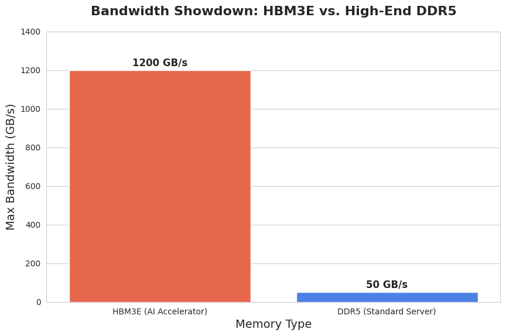
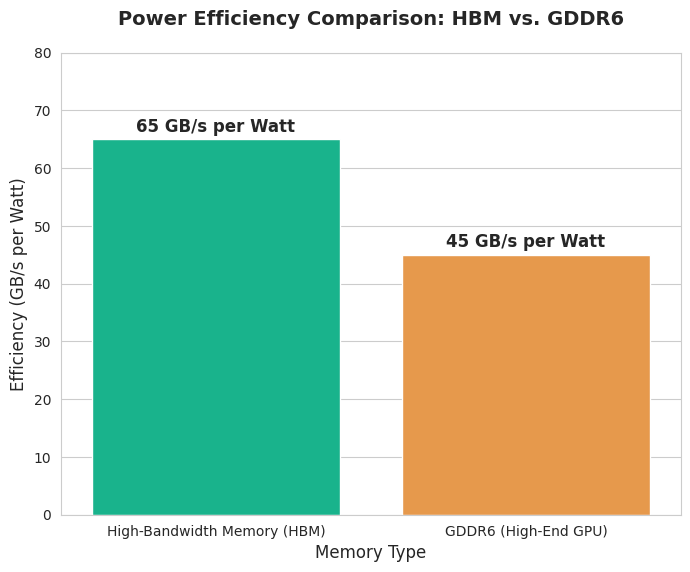
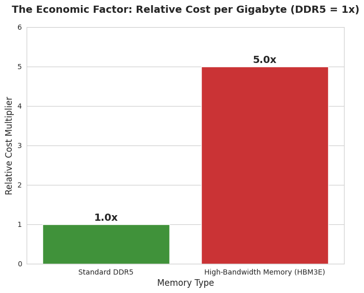
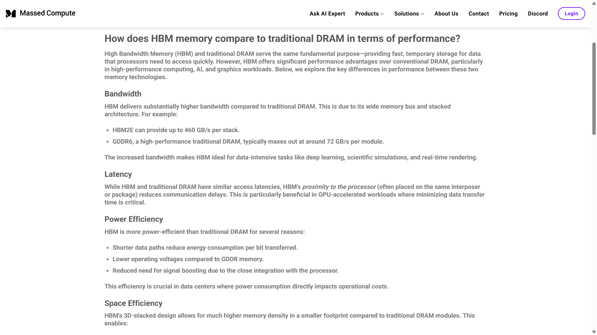
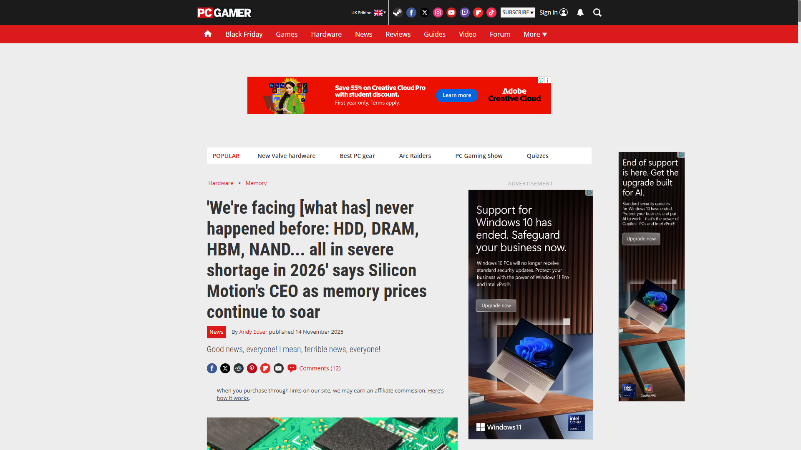

# The Core of the AI Bottleneck: HBM Analysis

## 🎥 HBM Visualized (Blender Animation)
https://github.com/user-attachments/assets/b500fa9d-ca6d-4589-9fbc-6c9a744326e4

---

## 📉 Project Overview
We are witnessing an unprecedented chip shortage, not of standard GPUs, but of the **High-Bandwidth Memory (HBM)** that powers them. This repository contains the data analysis and visual assets used to break down why HBM, not the GPU core, is the current bottleneck for AI scaling.

---

## 📊 Technical Breakdown

### 1. Bandwidth: HBM3E vs DDR5
The distinction is architecture. HBM uses **3D Stacking** (Through-Silicon Vias) to create a massive 8-lane silicon highway compared to the flat design of DDR5.

*A single stack of HBM3E delivers over 1.2 TB/s vs ~60 GB/s for DDR5.*

### 2. Power Efficiency
By keeping the data path short (vertical stacking), HBM requires significantly less energy per bit transferred.

### 3. The Economic Factor (Cost & Yield)
HBM requires advanced packaging (TSMC CoWoS). Yield rates for new generations like HBM3E can be as low as 40-60%, creating a supply shock and driving up costs relative to standard memory.

---

## 🐍 Data Analysis (Python)
I used Python to visualize the performance disparities.

### Code Execution Demo
[**🎥 Watch the Python Analysis Run**](python-analysis-demo.mp4)

### 📂 Access the Notebook
The full analysis code is available on Google Colab:
[**▶️ Open HBM_vs_DDR5_Analysis.ipynb**](https://colab.research.google.com/drive/1mYHD1e2pZayc5lYsse4gvAzvRxvi0Yzf?usp=drive_link)

---

## 📰 Market Context
News and market signals tracking the shortage:
| | |
|---|---|
|  |  |
|  |  |
